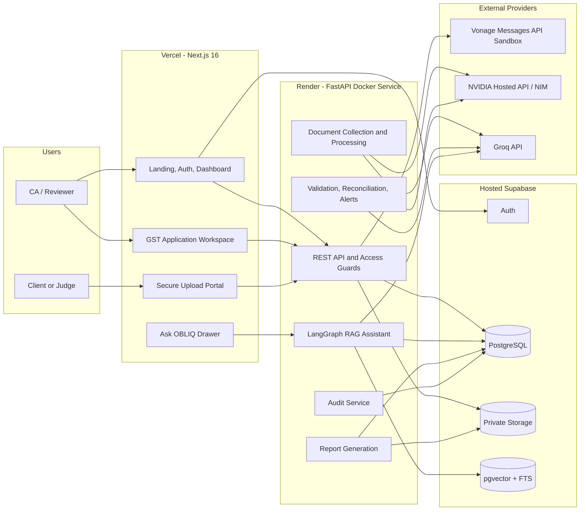
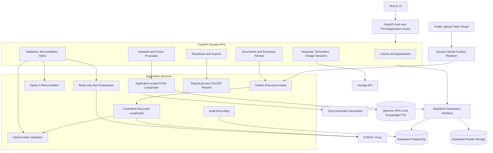
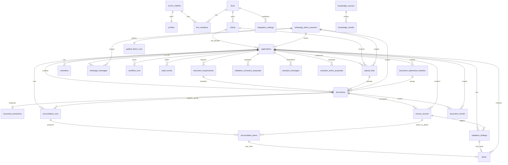
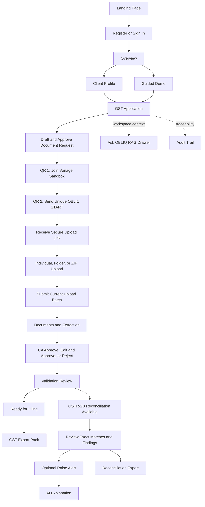
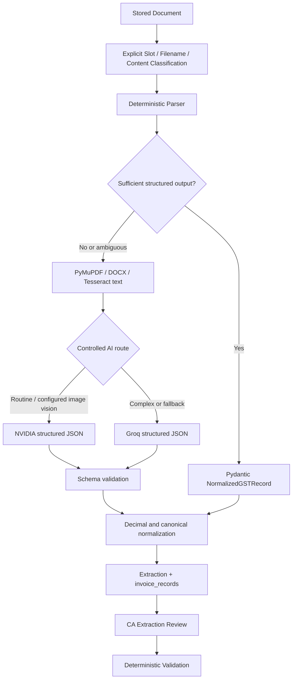
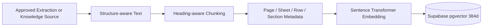
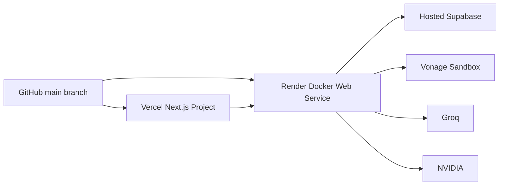

# GST Co-Pilot

**AI-assisted GST readiness and compliance workflow for Indian CA firms.**

GST Co-Pilot is the OBLIQ hiring prototype: one deeply implemented workflow for collecting GST records, extracting structured data, keeping a Chartered Accountant in control of review, validating the working, reconciling purchases with GSTR-2B, answering application-scoped questions, and producing preparatory reports.

**Built around:** Document Collection · AI/OCR Extraction · CA Review · Validation · GSTR-2B Reconciliation · RAG · GST Readiness · Audit · Exports

> **Professional responsibility:** GST Co-Pilot assists with preparation, review, and reconciliation. Final GST filing, ITC treatment, and professional compliance decisions remain with the assigned CA.

## Live Application

[Open GST Co-Pilot](https://obliq-gst-readiness-copilot.vercel.app/)

The placeholder above should be replaced with the final Vercel production URL. The API is deployed separately on Render.

## Environment Configuration

- [Environment Setup File](.env file :  https://drive.google.com/file/d/1x0dr2MX8kaEDBSUb9Xm7-ifQDXe_qfSc/view?usp=sharing) 
 ### for easy local Testing download the .env file from this Drive Link ##

 ### Use Datset from the folder : GST_Co-Pilot_test_Data for Application testing ( local/ live)


- [Repository environment template](.env.example) — contains variable names and safe placeholders only.
- [Frontend environment template](frontend/.env.local.example) — contains browser-safe variables only.
- Repository: [GST Co-Pilot source](<REPOSITORY_URL>)

Never commit `.env`, `.env.local`, service-role keys, AI keys, Vonage secrets, encryption keys, HMAC peppers, or private keys.

## Table of Contents

1. [Project Overview](#project-overview)
2. [Problem Statement](#problem-statement)
3. [Our Solution](#our-solution)
4. [Product Workflow](#product-workflow)
5. [Key Features](#key-features)
6. [High-Level Architecture](#high-level-architecture)
7. [System Design](#system-design)
8. [Database Schema](#database-schema)
9. [User Flow](#user-flow)
10. [Feature-by-Feature Implementation](#feature-by-feature-implementation)
11. [Document Collection and WhatsApp](#document-collection-and-whatsapp)
12. [AI Document Extraction and OCR](#ai-document-extraction-and-ocr)
13. [AI Orchestration with LangGraph](#ai-orchestration-with-langgraph)
14. [Validation](#validation)
15. [GSTR-2B Reconciliation](#gstr-2b-reconciliation)
16. [Alerts and AI Explanations](#alerts-and-ai-explanations)
17. [Retrieval-Augmented Generation](#retrieval-augmented-generation-rag)
18. [Human-in-the-Loop Design](#human-in-the-loop-design)
19. [Audit Trail](#audit-trail)
20. [GST Readiness and Reports](#gst-readiness-and-reports)
21. [Tech Stack](#tech-stack)
22. [Backend API Architecture](#backend-api-architecture)
23. [Frontend Architecture](#frontend-architecture)
24. [Repository Structure](#repository-structure)
25. [Original Assignment Coverage](#original-assignment-coverage)
26. [Local Development Setup](#local-development-setup)
27. [Environment Variable Reference](#environment-variable-reference)
28. [Supabase Setup](#supabase-setup)
29. [Vonage Local Setup](#vonage-local-setup)
30. [Local End-to-End Test](#local-end-to-end-test)
31. [Testing](#testing)
32. [Docker](#docker)
33. [Deployment](#deployment)
34. [Security and Data Isolation](#security-and-data-isolation)
35. [Current Limitations](#current-limitations)
36. [Path to Production-Grade Scale](#path-to-production-grade-scale)
37. [Future Scope](#future-scope)
38. [Disclaimers](#disclaimers)

---

## Project Overview

GST Co-Pilot focuses on the work a CA firm performs **before a GST return is filed**. Instead of presenting many shallow compliance modules, it implements one GST-readiness workflow from request to reviewed working paper.

Each `applications` row represents one client and GST period. Its checklist, uploads, normalized GST records, validation findings, reconciliation run, alerts, RAG conversation, audit history, readiness state, and reports remain application-scoped.

The main preparation path is:

```text
Client GST Period
  -> Document Request
  -> Secure Collection
  -> Extraction / OCR / AI
  -> CA Extraction Review
  -> Deterministic Validation
  -> CA Validation Review
  -> Ready for Filing
  -> GST Export Pack
```

After validation, reconciliation is available as an independent review branch:

```text
Validated Purchase Data + GSTR-2B
  -> Deterministic Reconciliation
  -> Mismatch Review
  -> Optional CA-Raised Alert
  -> AI Explanation
  -> Reconciliation Working Report
```

“Ready for Filing” means the preparatory validation workflow is complete. It does **not** mean GST Co-Pilot has filed a return.

## Problem Statement

CA teams often coordinate multiple clients and GST periods while documents arrive through different channels and at different times. The workflow represented by this project can involve repeated follow-ups, manual invoice reading, spreadsheet-heavy review, disconnected reconciliation work, and limited visibility into who reviewed what.

The central questions occur before filing:

- Which of the required records are still missing?
- Which files have arrived, and which GST category do they belong to?
- What invoices and tax values were extracted from those files?
- Does the extracted data agree with the source document?
- Which records fail deterministic checks?
- Does the books-side Purchase Register agree with GSTR-2B?
- Which mismatches became formal CA alerts?
- Is the preparatory working ready to export?

GST Co-Pilot is designed to put those answers in one traceable, period-specific workspace without giving AI authority over filing or professional tax decisions.

## Our Solution

The implementation combines:

| Layer | What it contributes |
|---|---|
| Client and GST workspaces | A scoped record of one client, one GST period, and its progress |
| Vonage document requests | CA-reviewed WhatsApp request/reminder messages through the real Messages API Sandbox |
| Secure browser intake | Expiring, scoped upload capabilities backed by private Supabase Storage |
| Unified ingestion | Individual, browser-folder, and ZIP uploads enter one pipeline |
| Deterministic parsing | Structured files and text are parsed before an LLM is considered |
| OCR and AI assistance | Tesseract, NVIDIA, and Groq handle inputs that require more interpretation |
| Human review | Original extraction and reviewed/corrected values are kept separately |
| Deterministic validation | Format, period, arithmetic, client, and duplicate checks |
| Exact reconciliation | Decimal-based books-versus-GSTR-2B matching with field-level evidence |
| Alerts | Explicit CA action converts a finding into an alert; AI then explains read-only evidence |
| Application-scoped RAG | Exact database facts plus scoped document/knowledge retrieval and citations |
| Readiness and reports | Backend-derived progress, GST Export Pack, and reconciliation working report |
| Audit trail | Safe before/after data and significant workflow events |

### A specialized CA work-management pattern

General work management often looks like:

```text
Project -> Tasks -> Progress -> Review -> Report
```

GST Co-Pilot specializes that pattern:

```text
Client GST Period -> Checklist -> Request -> Collection -> Extraction
                  -> Validation -> Reconciliation -> CA Review -> Export
```

The same concepts could support other compliance workflows later, but GST is the only deeply implemented domain in this repository.

## Product Workflow

The readiness workflow has one main gate and one parallel review branch:

```text
Documents Requested
  -> Documents Received
  -> Extraction Review
  -> Validation Review = 100%
       |-> Ready for Filing = 100% -> Main Export Pack
       `-> GSTR-2B Reconciliation available
             -> Reconciliation Review = 100%
             -> Reconciliation Export
```

Important behavior:

- GSTR-2B is **not** one of the six client checklist requirements.
- Reconciliation does not block Ready for Filing after validation reaches 100%.
- The main Export Pack is backend-gated by validation-derived readiness.
- The reconciliation report is independently backend-gated by reconciliation review completion.
- Progress percentages are derived from persisted records, not hard-coded in React.

## Key Features

### Workspace and collection

- Supabase email/password authentication and first-login tenant bootstrap
- User-created client profiles and period-specific GST applications
- One tenant-scoped Raj Traders Guided Demo template initialized during first-login bootstrap; isolated runs begin only after an explicit Guided Demo start
- Six-category document checklist with dynamic collection progress
- CA-reviewed Draft Request and Draft Reminder
- Real Vonage Messages API WhatsApp Sandbox text workflow
- Private, expiring secure upload portal
- Individual, folder, and safe ZIP intake
- Submission batches and background processing status

### Extraction and review

- Deterministic slot/filename/content classification, with unresolved files held for CA assignment
- CSV/XLSX/JSON structured parsing
- PyMuPDF text extraction, `python-docx`, image/scanned-PDF Tesseract OCR
- Hosted NVIDIA routine extraction and vision support when configured
- Groq heavy extraction/fallback for complex documents
- Pydantic-validated normalized GST records with PostgreSQL `numeric` money fields
- Category and combined extraction portfolios, table/card views, filters, selection, and bulk review
- Approve, Edit & Approve, Reject/Clarify-style review states
- Original structured output retained separately from reviewed values

### Validation, reconciliation, and alerts

- Deterministic validation findings with evidence
- Manual and AI-assisted correction proposals with before/after preview and explicit confirmation
- GSTR-2B upload in the reconciliation workspace
- Deterministic Option A reconciliation with exact Decimal comparisons
- Field-level Books versus GSTR-2B evidence
- Select All and explicit bulk review actions
- Manual Raise Alert flow for validation and reconciliation findings
- NVIDIA-first structured alert explanation with Groq fallback
- Dynamic Alerts Dashboard and audit history

### RAG, readiness, and reporting

- Persistent right-side Ask OBLIQ drawer across GST workspace tabs
- Application-scoped structured queries and pgvector document retrieval
- Firm/shared knowledge vector + lexical retrieval with reciprocal-rank fusion
- Controlled LangGraph planning, action proposals, grounding, citations, and audit
- Backend-derived workflow progress and Ready for Filing state
- Downloadable GST preparatory Export Pack (PDF + CSVs in ZIP)
- Downloadable GSTR-2B reconciliation working report (PDF + CSV in ZIP)
- Responsive light/dark Next.js interface and real Guided Demo instructional layer

---

## High-Level Architecture



### Architecture layers

- **Frontend:** Next.js App Router renders authentication, client/application dashboards, secure uploads, review portfolios, reconciliation, alerts, audit, Guided Demo instructions, and the persistent RAG drawer.
- **Backend/API:** FastAPI authenticates users through Supabase, derives firm/application scope, exposes controlled domain APIs, performs background document work, and never gives the browser arbitrary database access.
- **AI processing:** deterministic code runs first. NVIDIA handles routine structured assistance and configured image vision; Groq handles complex extraction, RAG generation, and approved fallbacks.
- **Persistence:** Supabase PostgreSQL stores business/workflow state; private Storage stores documents and report artifacts; pgvector and PostgreSQL full-text search support retrieval.
- **Messaging:** the Vonage WhatsApp Sandbox transports approved text requests, reminders, START commands, status commands, and delivery callbacks. Direct WhatsApp attachment download is not implemented.
- **Deployment:** Render builds the backend Dockerfile; Vercel builds `frontend/` natively; Supabase and hosted AI/messaging providers remain external managed services.

## System Design

The architecture diagram shows the systems. This diagram shows how a request moves through internal services.



The `DataStore` abstraction has Supabase and in-memory implementations. The in-memory store exists for tests and explicit local demo mode; deployed mode is required to use Supabase.

## Database Schema

The schema is defined by forward migrations in [`supabase/migrations/`](supabase/migrations/). The diagram below includes every persistent application table that is central to the current runtime.



### Database table catalog

#### Identity, tenancy, and GST work

| Table | Purpose | Important relationships | Main information stored |
|---|---|---|---|
| `profiles` | Application profile for a Supabase Auth user | `profiles.id -> auth.users.id` | Name, email, timestamps |
| `firms` | CA firm workspace | Parent of membership, clients, knowledge, audit | Firm name and unique slug |
| `firm_members` | User-to-firm membership and role | Firm + Auth user | `firm_admin`, `gst_preparer`, or `reviewer` |
| `clients` | Tenant-owned GST client profile | Firm; parent of applications | Legal/trade identity, GSTIN, filing frequency, contact and consent metadata |
| `applications` | One GST-readiness period | Firm + client; parent of workflow data | Period, FY, due date, assignments, status, optional demo-session link |
| `document_requirements` | Six-category checklist | Application | Requirement type, label, required flag, collection/review status |
| `workflow_runs` | Generic workflow state persistence | Firm + application | Workflow type, current state, state JSON, human-wait/completion status |
| `guided_demo_runs` | Persistent user-scoped Guided Demo history | Firm, user, template client, base/session applications and session | Run number/name, active/completed/cancelled status |

#### Documents, extraction, validation, and submission

| Table | Purpose | Important relationships | Main information stored |
|---|---|---|---|
| `upload_links` | Secure upload capability metadata | Firm, client, application, optional requirement/session | HMAC token hash, expiry, revocation, creator |
| `documents` | File metadata and private Storage pointer | Application, requirement, upload link, session, optional batch | Original/safe name, MIME, bucket/path, checksum, classification, processing state/error |
| `document_submission_batches` | Explicit Submit boundary for public uploads | Application, upload link, session | Immutable batch ID, counts, submitted/completed state |
| `document_extractions` | One structured extraction per document | Unique document | Raw text, original/current structured JSON, confidence, provider/model/task timing, review status |
| `invoice_records` | Normalized GST records | Firm, client, application, document | Invoice identities, dates, GSTINs, Decimal tax values, GST metadata, provenance, review status |
| `validation_findings` | Deterministic validation evidence | Application, optional document/record | Finding type, severity, message/details, review/resolution state |
| `validation_correction_proposals` | Manual or AI correction proposal | Application and affected record IDs | Before/after changes, rationale, provider/model, proposed/applied/rejected status |

#### Reconciliation, alerts, messaging, and audit

| Table | Purpose | Important relationships | Main information stored |
|---|---|---|---|
| `reconciliation_runs` | One books/GSTR-2B comparison execution | Application and GSTR-2B document | Run status, summary, timestamps, creator |
| `reconciliation_items` | Deterministic result per paired/unpaired record | Run and books/GSTR-2B invoice records | Match status, exact differences, immutable evidence, flags, CA review state |
| `alerts` | CA-raised validation or reconciliation alert | Application, optional finding/item | Category/type, message, severity/status, evidence, structured AI explanation metadata |
| `reminders` | Draft/approved/sent client communication | Firm, client, application | Reminder type, draft and approved copy, provider and lifecycle timestamps |
| `whatsapp_demo_sessions` | Isolated Vonage Sandbox session | Firm, base client/application, cloned application, creator | Hashed/encrypted identity binding, token hashes, expiry, state and retention metadata |
| `whatsapp_messages` | Inbound/outbound/status message ledger | Firm/client/application/session | Provider message ID, direction/type, safe content, encrypted/masked addressing, delivery status |
| `integration_settings` | Firm messaging integration status | Firm | Provider and connection/last-activity metadata |
| `audit_events` | Append-oriented trace of meaningful actions | Firm, user, client, application, optional session | Entity/action, safe before/after JSON, metadata, timestamp |

#### RAG and knowledge

| Table | Purpose | Important relationships | Main information stored |
|---|---|---|---|
| `knowledge_sources` | Firm-specific or shared approved knowledge source | Optional firm | Source type/title/URL/storage path/version/effective dates/checksum/status |
| `knowledge_chunks` | Searchable knowledge text | Knowledge source | Content, metadata, generated full-text vector, 384-dimensional embedding |
| `document_chunks` | Approved application-document evidence | Document, application, client, firm, optional session | Content, page/sheet/row/section provenance, checksum, embedding model/vector |
| `assistant_messages` | Application-scoped conversation history | User + firm + application + conversation | Role, content, citations, source types |
| `assistant_action_proposals` | Preview/confirm boundary for assistant actions | User + firm + application + conversation | Allowed action, payload, preview, evidence fingerprint, expiry and execution result |

### PostgreSQL and Storage together

PostgreSQL stores metadata, structured records, review state, and references. Original documents and generated reports are bytes in private Supabase Storage buckets:

- `gst-documents`
- `knowledge-documents`
- `exports`

The browser does not receive a service-role key. Access-controlled backend endpoints either stream data or return short-lived signed links; permanent public signed URLs are not stored.

## User Flow



## Feature-by-Feature Implementation

### Authentication and tenant bootstrap

Supabase Auth is the user identity authority in the real runtime. `backend/app/dependencies.py` resolves the authenticated user and verifies firm membership. The first authenticated bootstrap creates a tenant firm workspace and one Raj Traders Guided Demo template; it does not populate every account with multiple seed clients.

Users can create any number of their own client profiles through the existing client APIs and dashboard. Roles are stored in `firm_members` and enforced by route dependencies.

**Important modules:**

- `backend/app/api/v1/onboarding.py`
- `backend/app/services/onboarding.py`
- `backend/app/dependencies.py`
- `frontend/lib/auth.tsx`
- `frontend/app/auth/`

### Client profiles and GST applications

A client stores GST identity, state, filing cadence, contact information, WhatsApp consent, and CA assignments. A GST application adds a financial year, period, due date, its own checklist, and its own workflow state. This period boundary is reused across extraction, validation, reconciliation, RAG, audit, and exports.

**Important modules:** `backend/app/api/v1/clients.py`, `backend/app/api/v1/applications.py`, and the client/application pages under `frontend/app/dashboard/`.

### Guided Demo

The Guided Demo is an instructional layer over the real Phase 1–4 workflow, not a set of hard-coded completed screenshots.

When a user explicitly starts it:

1. The tenant-scoped Raj Traders template is located.
2. A fresh isolated WhatsApp demo session and cloned application/checklist are created.
3. A numbered `guided_demo_runs` record such as `Guided Demo 1` is persisted.
4. Reusable `GuidedDemoStep` cards guide Request, Vonage, Upload, Extraction, Validation, and Export/Reconciliation.
5. Completion is recorded only after the real workflow reaches its completion condition.
6. Completed history stays visible on Overview, and Restart creates the next isolated numbered run.

**Important modules:** `backend/app/services/guided_demo.py`, `backend/app/api/v1/guided_demo.py`, `frontend/components/guided-demo/`, and `frontend/lib/whatsapp-demo.ts`.

---

## Document Collection and WhatsApp

### Final six-category client checklist

| Internal type | UI label | Role in the workflow |
|---|---|---|
| `sales_register` | Sales Register | Tabular books-side outward-supply records |
| `purchase_register` | Purchase Register | Principal books-side input for GSTR-2B reconciliation |
| `sales_invoices` | Sales Invoices | Source support for sales entries |
| `purchase_expense_invoices` | Purchase & Expense Invoices | Source support for purchases and expenses |
| `credit_debit_notes` | Credit & Debit Notes | Adjustments and original-document references |
| `gst_special_transactions` | GST Special Transactions | Prototype subtypes such as RCM, exempt/nil/non-GST, advances, import/export/SEZ/LUT, and adjustments |

GSTR-2B is a separate government-side input. It is uploaded and parsed in the reconciliation workspace and never increases the six-document collection percentage.

### Request and reminder workflow

1. The CA opens a GST application and reviews the live six-category checklist.
2. **Draft Request** creates checklist-derived copy; the CA approves before sending.
3. Vonage sends the approved text through the active Sandbox conversation.
4. The message contains a secure browser upload link derived from `FRONTEND_URL`.
5. **Draft Reminder** recalculates currently missing categories at draft time; it does not reuse stale missing-document text.

Requests and reminders are human-controlled outbound actions. The system does not automatically spam clients.

### Why two QR codes exist

- **QR 1 — Vonage Sandbox Connection:** joins/allows the judge’s WhatsApp number in the Vonage Sandbox. This must happen first.
- **QR 2 — Start OBLIQ Session:** opens a pre-filled, unique `START` message. Its single-use token binds that WhatsApp identity to the correct isolated cloned GST application.

The webhook accepts signed Vonage JSON events at:

```text
POST /api/v1/webhooks/vonage/whatsapp
POST /api/v1/webhooks/vonage/status
```

Supported text commands use centralized application state: `STATUS`, `HELP`, and `CANCEL`. GSTR-2B is not reported as a missing client document.

### Secure upload design

The upload URL contains a high-entropy token. The database stores only its domain-separated HMAC hash. Resolution verifies expiry/revocation and reconstructs the authorized firm, client, application, optional demo session, and checklist scope on the server.

The upload layer enforces configured extension/MIME/signature checks, file-size limits, safe names, SHA-256 duplicate detection, private Storage paths, and application/session consistency. Clients can use the scoped link without a normal CA dashboard login.

### Individual, folder, and ZIP upload

All modes converge on `ingest_document(...)` in `backend/app/services/document_processing/pipeline.py`:

```text
Individual slot | Browser folder | ZIP
                  -> validate and classify
                  -> private Storage
                  -> documents metadata
                  -> awaiting_submission
                  -> explicit Submit
                  -> document_submission_batches
                  -> FastAPI BackgroundTasks
                  -> shared extraction graph
```

ZIP intake rejects traversal paths, limits entry count and total size, ignores unsupported entries, and uses temporary processing only. A submission response returns without waiting for OCR/AI/RAG completion; the dashboard polls persisted status.

### Developer Ground Truth boundary

`00_Set_Index_and_Ground_Truth.pdf` is classified as `developer_ground_truth` and stored, when detected, with `processing_status = excluded_reference`. It is not:

- counted in the checklist;
- parsed into normalized GST records;
- sent to NVIDIA or Groq as business evidence;
- used in reconciliation;
- embedded or retrieved by RAG;
- included in reports.

This prevents expected synthetic answers from leaking into runtime logic.

### Direct WhatsApp attachments are not implemented

Phase 5 media download is intentionally absent. A direct attachment event is not downloaded into Storage or routed to extraction. The current real client transport remains:

```text
Vonage WhatsApp request -> secure browser link -> upload portal -> Supabase Storage
```

---

## AI Document Extraction and OCR

### Processing pipeline



### Classification order

The current implementation prefers:

1. explicit individual upload slot;
2. deterministic known filename;
3. deterministic content/header rules;
4. `unknown` / `needs_assignment` for unresolved classification.

An ambiguous file is never silently forced into Purchase Invoices. NVIDIA and Groq assist extraction only after a usable business document category is known; a CA can reclassify an unknown document through the review API.

### Deterministic parsers

| Input | Implementation | LLM required? |
|---|---|---:|
| CSV | pandas | No |
| XLS/XLSX | pandas + openpyxl | No |
| JSON | Python JSON parsing and normalized table mapping | No |
| Text PDF | PyMuPDF | Only if structured interpretation is still required |
| DOCX | python-docx | Only if structured interpretation is still required |
| JPG/JPEG/PNG | Pillow + Tesseract text, optional NVIDIA vision | Sometimes |
| Scanned PDF | PyMuPDF page rendering + Tesseract | Sometimes after OCR |

Clean spreadsheet registers are not sent to an LLM merely because one is configured.

### Active AI routing

Provider/model values are environment-configurable. The checked-in example currently documents:

| Task | First route | Fallback / heavy route |
|---|---|---|
| Clean CSV/XLSX/JSON | Deterministic parser | None |
| Routine structured extraction from clean text | NVIDIA small model | Groq if the call or schema fails |
| Configured JPG/PNG vision | NVIDIA vision model | Groq text fallback after available OCR text |
| Credit/Debit Notes and GST Special Transactions | Groq heavy route | Needs review on failure |
| Ambiguous/complex extraction | Groq | Needs review on failure |
| Alert explanation | NVIDIA small model | Groq |
| RAG grounded generation and unresolved query planning | Groq RAG model | Deterministic/abstaining response paths |

The example model configuration is:

```text
GROQ_MODEL=openai/gpt-oss-120b
GROQ_HEAVY_MODEL=openai/gpt-oss-120b
GROQ_RAG_MODEL=openai/gpt-oss-120b
NVIDIA_SMALL_MODEL=meta/llama-3.1-8b-instruct
NVIDIA_VISION_MODEL=meta/llama-3.2-11b-vision-instruct
```

Deployments may change these names through environment variables without changing application code. The active Phase 3/4 runtime does not require Gemini, Twilio, or Meta WhatsApp credentials.

### Normalized GST record

Normalized records preserve available values such as:

```text
tax_period, document_type, invoice_category,
supplier/customer names and GSTINs,
invoice/document number and date, place_of_supply, hsn_sac,
taxable_value, gst_rate, igst, cgst, sgst_utgst, cess,
total_tax, total_document_value,
transaction_type, itc_status, rcm_flag,
original_document_reference,
source_document_id, source_page, source_row
```

Missing fields remain null; the pipeline does not invent values. Monetary fields are validated with `Decimal` and persisted as PostgreSQL `numeric`. AI output must pass `NormalizedGSTRecord` Pydantic validation before persistence.

Each extraction also records provider/model, task type, start/completion time, duration, fallback reason, confidence, original structured data, and reviewed data where available.

## AI Orchestration with LangGraph

The project uses controlled graphs rather than autonomous open-ended agents.

### Document graph

`backend/app/agents/document_workflow.py` defines:

```text
load_document
  -> classify_document
  -> parse_and_extract
  -> persist_extraction
  -> validate_document
```

The graph state contains the document ID, loaded file/context, classification, raw text, structured data, provider metadata, and status. Persistence and validation remain explicit nodes.

### Assistant graph

`backend/app/agents/rag_assistant.py` defines:

```text
validate_access
  -> classify_question
  -> load_structured_facts
  -> execute_structured_tools
  -> build_action_proposal
  -> retrieve_application_evidence
  -> retrieve_knowledge_if_needed
  -> generate_grounded_answer
  -> verify_scope_and_citations
  -> audit
```

Access is decided before retrieval. The LLM cannot create its own SQL or access rule. Mutating assistant requests become time-limited proposals with a preview and evidence fingerprint; a CA must explicitly confirm before the backend executes an allowed action.

The repository also contains a controlled reminder workflow for drafting checklist-aware communication.

---

## Validation

Validation runs against approved or edited-and-approved client extraction records. GSTR-2B and developer Ground Truth are excluded from client validation.

### Implemented checks

| Finding | Deterministic rule |
|---|---|
| `missing_required_field` | Invoice number is absent |
| `invalid_gstin_format` | Supplier GSTIN fails the implemented format regex |
| `missing_gstin` | Supplier GSTIN is absent |
| `invalid_date` | Invoice date is absent |
| `future_date` | Invoice date is after the validation date |
| `wrong_period` | Invoice date falls outside the application period |
| `wrong_client` | Available customer GSTIN does not match the selected client |
| `tax_total_mismatch` | Invoice total differs from taxable value + CGST + SGST + IGST + cess by more than the validation arithmetic tolerance |
| Duplicate finding | Supplier GSTIN + normalized invoice number + date + total identifies repeated records |

The validation arithmetic check uses a default ₹1.00 tolerance for invoice-total arithmetic. This is separate from reconciliation, where monetary equality has **no tolerance**.

### Review and correction

The Validation UI groups findings by the six document categories and displays invoice identity and human-readable evidence rather than relying on raw IDs. The CA may:

- mark a finding reviewed/resolved;
- raise a categorized validation alert;
- propose a manual field correction;
- request an NVIDIA-first, Groq-fallback AI correction recommendation;
- inspect an exact before/after preview;
- explicitly apply or reject the proposal.

AI correction is read-only until the CA confirms. Applying a proposal records before/after audit evidence and reruns affected validation.

### Completion

Validation progress is derived from persisted review-required findings. If there are no review-required findings after a completed validation run, the zero-findings case can complete rather than becoming an impossible 0/0 state.

## GSTR-2B Reconciliation

GSTR-2B is uploaded separately through the reconciliation API and parsed into government-side normalized records. Uploading it sets the input to a ready state; reconciliation does not begin until the CA presses **Start Reconciliation**.

### Deterministic Option A algorithm

#### Stage 1 — obvious identity

Records pair on:

```text
uppercase/trimmed supplier GSTIN
+
trimmed/uppercase invoice number
```

When exactly one candidate exists, the engine compares every available relevant field:

- invoice date;
- taxable value;
- IGST, CGST, SGST, cess;
- total document value;
- ITC status;
- RCM flag.

No differences produce `exact_match`; any exact field differences produce `value_mismatch` with Books, GSTR-2B, and difference evidence.

#### Stage 2 — invoice number mismatch

For remaining records, the engine looks for candidates with exact supplier GSTIN, date, monetary fields, ITC status, and RCM state, but a different invoice number.

- exactly one candidate -> `invoice_number_mismatch`;
- multiple candidates -> `ambiguous_match`;
- unmatched books record -> `books_only`;
- unmatched government record -> `gstr2b_only`.

### Result types

| Result | Meaning |
|---|---|
| `exact_match` | Identity and all compared available fields agree |
| `value_mismatch` | Identity matched but one or more compared fields differ |
| `invoice_number_mismatch` | Stage 2 found one exact supporting-field candidate with a different invoice number |
| `books_only` | Books record has no deterministic GSTR-2B pair |
| `gstr2b_only` | GSTR-2B record has no deterministic books pair |
| `ambiguous_match` | More than one Stage 2 candidate exists; the engine refuses to guess |
| `duplicate` | Schema-supported legacy/result category; the current Option A pass does not emit it and instead handles Stage 2 ambiguity explicitly |

Special flags separately identify `itc_not_available`, `rcm`, and credit/debit-note evidence.

### Exactness boundary

- Monetary values are quantized through `Decimal` and compared exactly.
- There is no ₹1/₹2 reconciliation tolerance.
- There is no nearest-money or fuzzy value matching.
- Groq and NVIDIA do not select matches or classifications.
- The persisted reconciliation item is the source of truth used by the UI, alerts, RAG, and reports.

## Alerts and AI Explanations

A deterministic finding does not automatically become an Alerts Dashboard item.

```text
Validation/Reconciliation Finding
  -> CA reviews evidence
  -> CA presses Raise Alert
  -> Alert and immutable evidence snapshot are stored
  -> NVIDIA explains the stored evidence
  -> Groq is used only if NVIDIA fails or returns invalid structure
```

The structured explanation contains:

- `title`
- `what_happened`
- `why_flagged`
- `what_ca_should_review`
- `short_summary`

The Alerts Dashboard displays categorized validation/reconciliation alerts, exact evidence, Books versus GSTR-2B comparisons where applicable, status, and AI assistance. If AI fails, the alert and evidence remain intact and the user can retry explanation generation.

AI does not change the reconciliation class, extracted values, GSTR-2B values, ITC status, review status, or alert lifecycle.

---

## Retrieval-Augmented Generation (RAG)

The Phase 4 assistant combines exact structured facts with scoped textual evidence. It is not a global chatbot over every firm’s data.

### Evidence layers

1. **Exact application facts:** checklist counts, extraction records, validation findings, reconciliation items, raised alerts, and audit events loaded through controlled repositories/tools.
2. **Approved application-document evidence:** normalized approved rows or extracted text indexed in `document_chunks`.
3. **Firm/shared knowledge:** approved SOP/guidance sources in `knowledge_sources` and `knowledge_chunks`.
4. **Groq generation:** a compact grounded answer built only after scope and evidence selection.

Questions such as “How many tax invoices?” or “Which invoice has the lowest taxable value?” use structured tools and Decimal values rather than vector similarity. Textual explanation and guidance can use vector/knowledge evidence.

### RAG ingestion pipeline



Current defaults:

| Setting | Value |
|---|---|
| Embedding provider | Local Sentence Transformers in the backend container |
| Model | `sentence-transformers/paraphrase-multilingual-MiniLM-L12-v2` |
| Dimension | 384 |
| Knowledge text chunk size | 900 characters |
| Overlap | 140 characters |
| Vector candidate count | 12 |
| Final evidence count | 5 |
| Minimum vector similarity | 0.45 |

The Docker image pre-caches the embedding model so local-container and Render code paths remain the same.

### What is indexed

- Approved/edited-and-approved normalized application records with document provenance
- Raw extracted document text only when no normalized records exist and the extraction is approved
- Uploaded/ingested firm or shared knowledge in TXT, Markdown, HTML, PDF, or DOCX form

The application index excludes developer Ground Truth, unknown/unassigned, failed, rejected, duplicate-ineligible, and unapproved documents. Checksums make indexing idempotent.

### Retrieval behavior

```text
Question
  -> verify authenticated firm/application access
  -> deterministic query plan where recognized
  -> load exact structured facts/tool result
  -> application pgvector RPC filtered by firm + application
  -> optional firm/shared knowledge vector search + lexical FTS
  -> reciprocal-rank fusion for knowledge results
  -> select a small context
  -> Groq grounded answer where needed
  -> backend citation/scope verification
  -> audit
```

Application documents currently use application-filtered vector retrieval. Firm/shared knowledge uses both pgvector and PostgreSQL full-text search, fused with reciprocal-rank fusion. There is no separate reranker or second vector database.

### Dynamic structured tools

The query planner supports controlled domains such as transactions, documents/checklist, validation, reconciliation, alerts, audit, application documents, and knowledge. Operations include filtered list/count/sum/average/minimum/maximum/summarize/explain. Fields and operators are allow-listed; the assistant cannot generate arbitrary SQL.

Controlled mutating requests can propose only approved action types, including extraction approve/reject, validation correction/review, reconciliation review, reconciliation alert raising, and reminder drafting. The flow is:

```text
Ask -> Preview Proposal -> Explicit CA Confirmation -> Execute -> Audit
```

### Application isolation and memory

Every assistant request includes the current `application_id`; the backend derives the user and firm. Conversations are keyed by user + application + conversation, with optional demo-session context. Switching applications therefore does not carry private client context into the next workspace.

The pgvector RPC additionally filters by firm and application, and RLS checks firm membership. The LLM does not decide access.

### Citations and guardrails

Citations can identify:

- document name, page, sheet, row range, or section where available;
- `Reconciliation · <invoice>`;
- `Alert · <title/id>`;
- structured checklist/transaction/validation/audit facts;
- knowledge source title and stored source URL/section.

Uploaded text is treated as evidence, not instructions. A prompt-injection sentence inside a document cannot override application scope. Factual application answers require structured or retrieved evidence; if the evidence is insufficient, the assistant abstains. Final GST/ITC judgments remain advisory and CA-controlled.

### Assistant UI

`frontend/components/assistant/assistant-panel.tsx` provides one persistent right-side **Ask OBLIQ** drawer within the application workspace. It shows the current client/GST period, conversation, source chips/citations, loading/error states, and deterministic suggestion chips based on available workflow state.

---

## Human-in-the-Loop Design

The central design rule is:

> **AI assists. Deterministic code verifies. The CA controls.**

Examples of explicit CA control:

- document requests and reminders are drafted before sending;
- extracted records are approved, edited and approved, or rejected;
- validation corrections show a before/after proposal before persistence;
- reconciliation is started manually after GSTR-2B is ready;
- reconciliation findings do not auto-create alerts;
- assistant mutations require a preview and explicit confirmation;
- readiness and export availability are deterministic backend states;
- the project never files a return or decides final ITC eligibility.

## Audit Trail

`audit_events` records meaningful, safe workflow actions rather than hidden model reasoning. Examples in the current code include:

- application/client creation and updates;
- upload-link creation, upload start/completion/failure, checklist receipt, and batch submission;
- document classification and extraction review;
- validation bulk review, alert raising, correction proposal/application;
- GSTR-2B upload, reconciliation start/completion/review;
- alert explanation generated/failed;
- assistant question/answer/action proposal/execution;
- GST Export Pack and reconciliation report generation;
- Vonage session creation, binding, reconnect, cancellation, request/reminder lifecycle.

Audit rows may store scoped entity IDs, safe metadata, and relevant before/after JSON. They do not store chain-of-thought, raw secret tokens, or plaintext API credentials.

## GST Readiness and Reports

### Backend-derived progress

`backend/app/services/workflow_progress.py` derives collection, extraction review, validation review, reconciliation review, and readiness from current records. The dashboard uses this backend summary; the browser cannot force readiness.

The current branch is intentional:

```text
Validation Review = 100%
  |-> Ready for Filing = true / 100%
  |-> Main Export Pack enabled
  `-> Reconciliation Review available but independent
```

Incomplete reconciliation does not reduce Ready for Filing.

### GST Export Pack

The main export is available only when backend readiness is complete. `backend/app/services/reports.py` uses ReportLab plus Python CSV/ZIP libraries to generate:

```text
OBLIQ_GST_Preparation_Export_Pack.zip
  |- GST_Readiness_Preparatory_Report.pdf
  |- Document_Manifest.csv
  |- Normalized_Sales_Data.csv
  |- Normalized_Purchase_Data.csv
  `- Validation_Summary.csv
```

The report covers client/firm/period details, the six-category collection summary, file manifest, normalized GST totals/records, validation review, explicitly raised alerts, readiness summary, and the actual reconciliation state. If reconciliation has not been performed, it says so instead of inventing results.

### Reconciliation Export

After the latest completed reconciliation has reached 100% review, a separate endpoint generates:

```text
OBLIQ_GSTR2B_Reconciliation_Export.zip
  |- GSTR2B_Reconciliation_Working_Report.pdf
  `- GSTR2B_Reconciliation_Details.csv
```

It includes Books/GSTR-2B identities and values, exact differences, classification, special flags, review state, whether an alert was raised, and available AI assistance.

Generated artifacts are uploaded to the private `exports` bucket and returned through short-lived signed URLs. Temporary report files do not require a persistent Render disk.

Both reports are preparatory working papers, not official GST Portal forms or filed returns.

---

## Tech Stack

| Layer | Technology | How it is used |
|---|---|---|
| Frontend | Next.js 16, React 19, TypeScript | App Router landing/auth/dashboard/upload/workspace UI |
| UI | Tailwind CSS 4, Motion, Lucide, Sonner | Responsive theme-aware styling, animation, icons, notifications |
| Forms | React Hook Form, Zod | Client-side form state and validation |
| Backend | FastAPI, Python 3.11, Uvicorn | REST API, auth guards, services, background tasks |
| Validation | Pydantic 2 | Settings, API contracts, AI structured-output validation |
| Database | Supabase PostgreSQL | Tenant, workflow, normalized GST, review, alert, audit, conversation state |
| Vector/search | pgvector + PostgreSQL FTS | Application embeddings and hybrid firm/shared knowledge retrieval |
| Storage | Private Supabase Storage | Original GST documents, knowledge files, generated exports |
| Authentication | Supabase Auth | Email/password browser sessions and backend identity verification |
| Tabular parsing | pandas, openpyxl | CSV/XLS/XLSX/JSON register parsing and normalization |
| Document parsing | PyMuPDF, python-docx, BeautifulSoup | PDFs, DOCX, and knowledge HTML/text extraction |
| OCR | Tesseract, pytesseract, Pillow | Scanned PDF and image text extraction |
| AI | NVIDIA hosted API | Routine structured extraction, configured image vision, alert/correction assistance |
| AI | Groq API | Heavy extraction fallback, RAG generation, unresolved query planning |
| Embeddings | Sentence Transformers | Local/containerized 384-dimensional multilingual embeddings |
| Orchestration | LangGraph | Controlled document and RAG workflows |
| Messaging | Vonage Messages API WhatsApp Sandbox | Signed inbound/status webhooks and approved outbound text |
| Reports | ReportLab, CSV, ZIP | Portable PDF and working-pack generation |
| Containers | Docker / Docker Compose | Render image and local production-parity smoke stack |
| Deployment | Render | Backend Docker Web Service from `main` |
| Deployment | Vercel | Native Next.js build from `frontend/` on `main` |

### Why these technologies

- **FastAPI** keeps typed APIs, background tasks, and Python parsing/AI libraries in one small backend.
- **Supabase** supplies Auth, relational state, private objects, RLS, and pgvector without adding separate prototype infrastructure.
- **pgvector** keeps retrieval beside the application/tenant data and enables scoped SQL/RPC filtering.
- **LangGraph** makes the document and assistant steps explicit and auditable without autonomous loops.
- **NVIDIA + Groq** provide a small-task/heavy-task routing split while leaving matching, money, access, and progress deterministic.
- **Vonage** supports the real WhatsApp Sandbox request journey used by the Guided Demo.
- **Docker** packages Tesseract, Python dependencies, and the embedding model consistently for local smoke tests and Render.
- **Next.js** provides a responsive dashboard, public upload route, server/client routing, and Vercel-native deployment.

## Backend API Architecture

All primary routes are mounted under `/api/v1`; interactive OpenAPI documentation is available at `/docs`.

| Router/module | Representative API surface |
|---|---|
| `health.py` | `GET /health` |
| `onboarding.py`, `users.py`, `firms.py` | tenant bootstrap, current profile/firm/members |
| `clients.py`, `applications.py` | client CRUD, period applications, checklist, collection/dashboard summaries |
| `guided_demo.py` | list/start/complete Guided Demo runs |
| `documents.py` | secure upload link, public intake/submit/folder/ZIP, documents, portfolio, processing and review |
| `whatsapp.py` | Draft Request/Reminder, session lifecycle, Vonage inbound/status webhooks, runtime status |
| `compliance.py` | validation, corrections, GSTR-2B, reconciliation, alerts, readiness, exports |
| `alerts.py` | alert list/detail/status and explanation retry |
| `rag.py` | knowledge ingestion, assistant query, action confirmation/cancellation |
| `audit.py` | application audit feed |

The repository layer lives under `backend/app/repositories/`. Domain code depends on the `DataStore` interface instead of scattering Supabase calls through routers.

## Frontend Architecture

The Next.js App Router contains:

- `/` — concise product landing page;
- `/auth/login` and `/auth/register` — Supabase email/password flow;
- `/dashboard` — cross-client summary and persistent Guided Demo history;
- `/dashboard/clients` — client directory and client-period management;
- `/dashboard/gst-work` — GST application list;
- `/dashboard/alerts` — dynamic Alerts Dashboard;
- `/dashboard/settings` — profile/firm settings;
- `/dashboard/applications/[applicationId]` — main workspace;
- `/dashboard/applications/[applicationId]/whatsapp-demo` — real Vonage session flow;
- `/upload/[token]` — public secure upload portal.

The main application workspace presents Overview, Documents & Extraction, Validation, GSTR-2B Reconciliation, and Audit Trail without creating separate processing systems. The Ask OBLIQ drawer remains application-scoped across these tabs.

Theme tokens in `frontend/app/globals.css` support light/dark backgrounds, surfaces, text, badges, and interactive states. Shared UI components provide accessible buttons, cards, modals, row detail, selection, and subtle reduced-motion-aware progress animation.

## Repository Structure

```text
gst-co-pilot/
|- backend/
|  |- app/
|  |  |- agents/                 # controlled LangGraph workflows
|  |  |- api/v1/                 # FastAPI routers
|  |  |- repositories/           # DataStore, Supabase, memory test store
|  |  |- schemas/                # Pydantic API/domain contracts
|  |  `- services/               # processing, validation, RAG, reports, messaging
|  |- tests/
|  |- Dockerfile
|  `- pyproject.toml
|- frontend/
|  |- app/                       # Next.js App Router pages
|  |- components/                # dashboard, documents, alerts, RAG, guided demo
|  |- lib/                       # API, Auth, types, view models
|  |- Dockerfile                 # local deployment smoke only
|  |- package.json
|  `- .env.local.example
|- supabase/
|  `- migrations/                # schema, RLS, RPCs, Storage, phases 1-4
|- scripts/                      # seed/reset, demo files, knowledge, cleanup
|- demo_data/
|  |- documents/                 # synthetic test documents
|  |- extractions/               # mock-mode extraction fixtures
|  `- knowledge/                 # synthetic SOP/guidance sources
|- docs/
|  |- deployment/render-vercel.md
|  |- local-setup.md
|  |- vonage-whatsapp-setup.md
|  `- architecture/phase notes
|- docker-compose.deploy-smoke.yml
|- render.yaml
|- .env.example
`- README.md
```

## Original Assignment Coverage

| Original requirement | GST Co-Pilot implementation | Status |
|---|---|---|
| Landing page + email/password Auth | Responsive OBLIQ landing page and Supabase Auth login/register | Implemented |
| Users + applications database | Profiles, firms, roles, clients, GST applications, RLS and period-scoped workflow tables | Implemented |
| First CA automation/AI workflow | End-to-end GST readiness from request through extraction, validation, reconciliation, alerts and exports | Implemented |
| RAG: chunking -> embeddings -> pgvector | Knowledge/application chunks, 384d Sentence Transformer embeddings, pgvector RPC retrieval, citations | Implemented |
| Backend API | Typed FastAPI domain routers and repository/service layers | Implemented |
| AI agent / LLM orchestration | Controlled LangGraph document and assistant workflows; NVIDIA/Groq routing | Implemented |
| Responsive Next.js + TypeScript dashboard | App Router dashboard, portfolios, validation/reconciliation, drawer, light/dark themes | Implemented |
| Deployment automation | Render and Vercel native Git deployment from `main`; Render Docker health check | Implemented |
| GitHub Actions CI/CD | No workflow exists; native platform Git deployments are used | Not implemented by design |
| Direct WhatsApp attachment ingestion | Explicitly deferred Phase 5; current transport uses secure browser upload links | Not implemented |

---

## Local Development Setup

### Prerequisites

- Git
- Python 3.11+
- Node.js 22 recommended (the frontend smoke Dockerfile uses Node 22)
- npm
- A hosted Supabase project for the real persistence/Auth/Storage path
- Vonage Messages API WhatsApp Sandbox credentials
- Groq and NVIDIA credentials for `AI_MODE=live`
- Tesseract installed locally, or use the backend Docker image that already contains it
- ngrok (or another HTTPS tunnel) for local Vonage callbacks
- Docker Desktop for container parity checks
- Supabase CLI for linked migration management (installed by the root `package.json`)

### 1. Clone

```powershell
git clone <REPOSITORY_URL>
Set-Location obliq-gst-readiness-copilot
```

### 2. Create local environment files

```powershell
Copy-Item .env.example .env
Copy-Item frontend/.env.local.example frontend/.env.local
```

On macOS/Linux:

```bash
cp .env.example .env
cp frontend/.env.local.example frontend/.env.local
```

Use `.env.example` only as a template. Put real backend values in the gitignored root `.env`; put only the four browser-safe `NEXT_PUBLIC_*` values in `frontend/.env.local`.

For a real local Supabase-connected run:

```env
APP_ENV=development
USE_IN_MEMORY_DB=false
AI_MODE=live
WHATSAPP_PROVIDER=vonage
FRONTEND_URL=http://localhost:3000
BACKEND_URL=http://localhost:8000
CORS_ORIGINS=http://localhost:3000

NEXT_PUBLIC_API_BASE_URL=http://localhost:8000/api/v1
NEXT_PUBLIC_DEMO_MODE=false
```

### 3. Install backend dependencies

```powershell
py -3.11 -m venv .venv
.\.venv\Scripts\python.exe -m pip install --upgrade pip
.\.venv\Scripts\python.exe -m pip install -e ".\backend[dev]"
```

macOS/Linux activation alternative:

```bash
python3.11 -m venv .venv
source .venv/bin/activate
python -m pip install -e './backend[dev]'
```

### 4. Install frontend and Supabase CLI dependencies

```powershell
npm.cmd ci
Set-Location frontend
npm.cmd ci
Set-Location ..
```

If `next` is reported as “not recognized,” frontend dependencies are missing; run `npm.cmd ci` inside `frontend` before `npm.cmd run dev`.

### 5. Start FastAPI

In terminal 1:

```powershell
Set-Location backend
..\.venv\Scripts\python.exe -m uvicorn app.main:app --reload --port 8000
```

Verify:

```powershell
Invoke-RestMethod http://localhost:8000/api/v1/health
```

The health response reports status, application, environment, repository mode, AI mode, and WhatsApp provider without making live provider calls. Swagger is available at `http://localhost:8000/docs`.

### 6. Start Next.js

In terminal 2:

```powershell
Set-Location frontend
npm.cmd run dev
```

Open `http://localhost:3000`.

### 7. Test Supabase Auth

With `NEXT_PUBLIC_DEMO_MODE=false`, use Register, Sign In, and Log Out in the browser. The first authenticated bootstrap creates the user’s firm workspace; the Guided Demo template is used only after an explicit Guided Demo start. User-created clients remain unrestricted within the firm workspace.

### 8. Generate optional synthetic fixtures

The repository already tracks synthetic examples. To regenerate supported demo documents where the script applies:

```powershell
.\.venv\Scripts\python.exe scripts\generate_demo_documents.py
```

To seed/reset local-only demo data, inspect `scripts/seed_demo.py` and `scripts/reset_demo.py` first. Never run a destructive reset against a hosted production project.

## Environment Variable Reference

The values below are the actual settings consumed by `backend/app/config.py` and the frontend configuration. “Required” refers to the real Supabase/live-AI/Vonage path unless noted otherwise.

### Application and URLs

| Variable | Required? | Used by | Purpose | Safe local example | Visibility |
|---|---:|---|---|---|---|
| `APP_NAME` | No | Backend | Display/API name | `OBLIQ GST Readiness Copilot` | Public config |
| `APP_ENV` | Yes | Backend | `development`, `test`, or `production` validation | `development` | Public config |
| `APP_DEBUG` | Yes in prod | Backend | Debug behavior; production requires false | `true` locally | Public config |
| `DEMO_MODE` | No | Backend | Prototype demo behavior flag | `true` locally | Public config |
| `USE_IN_MEMORY_DB` | Yes | Backend | Select memory test store vs Supabase; production requires false | `false` | Public config |
| `FRONTEND_URL` | Yes | Backend | Secure upload-link origin | `http://localhost:3000` | Public config |
| `BACKEND_URL` | Recommended | Backend | Canonical backend origin | `http://localhost:8000` | Public config |
| `PUBLIC_BASE_URL` | Yes | Backend/Vonage | Public webhook origin | current HTTPS tunnel | Public config |
| `API_V1_PREFIX` | No | Backend | API mount prefix | `/api/v1` | Public config |
| `CORS_ORIGINS` | Yes | Backend | Comma-separated browser origins | `http://localhost:3000` | Public config |
| `LOG_LEVEL` | No | Backend | Runtime logging threshold | `INFO` | Public config |

### Supabase

| Variable | Required? | Used by | Purpose | Safe local example | Visibility |
|---|---:|---|---|---|---|
| `SUPABASE_URL` | Yes | Backend | Hosted project URL | `https://<project-ref>.supabase.co` | Public identifier |
| `SUPABASE_ANON_KEY` | Recommended | Backend | Public/anon compatibility setting | placeholder only | Public |
| `SUPABASE_SERVICE_ROLE_KEY` | Yes | Backend | Privileged repository/Storage operations | never show | Secret |
| `SUPABASE_JWT_SECRET` | Optional | Backend | Retained compatibility setting | blank if unused | Secret |
| `SUPABASE_JWKS_URL` | Optional | Backend | Retained compatibility setting | blank if unused | Public config |
| `DATABASE_URL` | Optional | Tools | Direct DB/tooling compatibility; runtime repository uses Supabase client | pooler URL if needed | Secret |
| `SUPABASE_DOCUMENTS_BUCKET` | Yes | Backend | Private business documents | `gst-documents` | Public config |
| `SUPABASE_KNOWLEDGE_BUCKET` | Yes | Backend | Private knowledge documents | `knowledge-documents` | Public config |
| `SUPABASE_EXPORTS_BUCKET` | Yes | Backend | Private generated reports | `exports` | Public config |

### AI, OCR, and RAG

| Variable | Required? | Used by | Purpose | Safe local example | Visibility |
|---|---:|---|---|---|---|
| `AI_MODE` | Yes | Backend | `live` for real providers; `mock` only for tests/demo fixtures | `live` | Public config |
| `TEXT_LLM_PROVIDER` | Yes | Backend | Active text provider selector | `groq` | Public config |
| `VISION_LLM_PROVIDER` | Yes | Backend | Active vision provider selector | `nvidia` | Public config |
| `LLM_FALLBACK_PROVIDER` | Yes | Backend | Heavy fallback selector | `groq` | Public config |
| `GROQ_API_KEY` | Yes in live mode | Backend | Groq API authentication | never show | Secret |
| `GROQ_MODEL` | Yes | Backend | General Groq model | documented model name | Public config |
| `GROQ_HEAVY_MODEL` | Yes in live mode | Backend | Complex extraction model; falls back to `GROQ_MODEL` | documented model name | Public config |
| `GROQ_RAG_MODEL` | Recommended | Backend | RAG planning/generation model | documented model name | Public config |
| `NVIDIA_API_KEY` | Yes in live mode | Backend | Hosted NVIDIA authentication | never show | Secret |
| `NVIDIA_BASE_URL` | Yes | Backend | OpenAI-compatible hosted endpoint | `https://integrate.api.nvidia.com/v1` | Public config |
| `NVIDIA_SMALL_MODEL` | Yes in live mode | Backend | Routine extraction/explanation model | documented model name | Public config |
| `NVIDIA_VISION_MODEL` | Optional | Backend | Verified image-capable model | documented vision model | Public config |
| `EMBEDDING_PROVIDER` | Yes | Backend | `local` Sentence Transformer or test mock | `local` | Public config |
| `EMBEDDING_MODEL` | Yes | Backend | Embedding model ID | `sentence-transformers/paraphrase-multilingual-MiniLM-L12-v2` | Public config |
| `EMBEDDING_DIMENSION` | Yes | Backend/DB | Must match vector schema/RPC | `384` | Public config |
| `RAG_VECTOR_TOP_K` | No | Backend | Candidate count | `12` | Public config |
| `RAG_FINAL_TOP_K` | No | Backend | Final context count | `5` | Public config |
| `RAG_MIN_SIMILARITY` | No | Backend | Vector cutoff | `0.45` | Public config |
| `RAG_CHUNK_SIZE` | No | Backend | Chunk character target | `900` | Public config |
| `RAG_CHUNK_OVERLAP` | No | Backend | Chunk overlap | `140` | Public config |
| `RAG_GENERATION_TIMEOUT_SECONDS` | No | Backend | Groq generation timeout | `1.5` | Public config |
| `RAG_MAX_OUTPUT_TOKENS` | No | Backend | Assistant answer budget | `800` | Public config |
| `OCR_ENABLED` | No | Backend | Enables Tesseract OCR | `true` | Public config |
| `TESSERACT_CMD` | Platform-specific | Backend | Optional explicit binary path; empty in Docker | empty | Local config |

Legacy Gemini/OpenAI adapter fields remain in configuration for compatibility, but they are not required by the active Groq/NVIDIA Phase 3/4 path and should not be added to deployment merely to satisfy inactive code.

### Inactive compatibility and local seed settings

| Variable(s) | Runtime status | Purpose / warning |
|---|---|---|
| `GEMINI_API_KEY`, `GEMINI_TEXT_MODEL`, `GEMINI_VISION_MODEL` | Inactive in Phase 3/4 | Legacy adapter compatibility only; do not make these deployment requirements |
| `OPENAI_API_KEY`, `OPENAI_TEXT_MODEL`, `OPENAI_VISION_MODEL` | Inactive in Phase 3/4 | Legacy adapter compatibility only; the active generation providers are Groq and NVIDIA |
| `DEMO_ADMIN_EMAIL`, `DEMO_ADMIN_PASSWORD` | Local seed tooling | Synthetic MemoryStore/demo account only; never use the example password in production |
| `DEMO_PREPARER_EMAIL`, `DEMO_PREPARER_PASSWORD` | Local seed tooling | Synthetic preparer account for explicit seed flows |
| `DEMO_REVIEWER_EMAIL`, `DEMO_REVIEWER_PASSWORD` | Local seed tooling | Synthetic reviewer account for explicit seed flows |
| `DEMO_RESET_ON_START` | Local only | Controls explicit demo reset behavior; keep false for real data |
| `DEMO_SEED_DATA` | Local only | Enables synthetic seed data in the applicable local/demo path |

### Uploads and security

| Variable | Required? | Used by | Purpose | Safe local example | Visibility |
|---|---:|---|---|---|---|
| `MAX_UPLOAD_MB` | No | Backend | Per-file limit | `20` | Public config |
| `BULK_UPLOAD_MAX_FILES` | No | Backend | Bulk entry limit | `20` | Public config |
| `BULK_UPLOAD_MAX_TOTAL_MB` | No | Backend | Bulk total limit | `100` | Public config |
| `ALLOWED_UPLOAD_EXTENSIONS` | No | Backend | Intake allow-list | `pdf,png,jpg,jpeg,csv,xlsx,docx,json` | Public config |
| `UPLOAD_LINK_TTL_HOURS` | No | Backend | Upload capability lifetime | `72` | Public config |
| `UPLOAD_TOKEN_PEPPER` | Yes | Backend | HMAC protection for upload tokens | independently generated value | Secret |
| `LOCAL_UPLOAD_DIR` | Memory mode only | Backend | Non-production test storage | `.runtime/uploads` | Local config |
| `LOCAL_EXPORT_DIR` | Memory mode only | Backend | Non-production test reports | `.runtime/exports` | Local config |

### Vonage

| Variable | Required? | Used by | Purpose | Safe local example | Visibility |
|---|---:|---|---|---|---|
| `WHATSAPP_PROVIDER` | Yes | Backend | Active provider | `vonage` | Public config |
| `VONAGE_API_KEY` | Yes | Backend | Messages API authentication | never show | Secret |
| `VONAGE_API_SECRET` | Yes | Backend | Messages API authentication | never show | Secret |
| `VONAGE_SIGNATURE_SECRET` | Yes | Backend | Signed webhook validation | never show | Secret |
| `VONAGE_WHATSAPP_FROM` | Yes | Backend/UI | Sandbox sender | provider value | Public-ish config |
| `VONAGE_SANDBOX_JOIN_MESSAGE` | Yes | Backend/UI | Exact Sandbox allow-list message | provider value | Public-ish config |
| `VONAGE_MESSAGES_BASE_URL` | Yes | Backend | Sandbox API base | `https://messages-sandbox.nexmo.com` | Public config |
| `WHATSAPP_DEMO_TOKEN_EXPIRY_MINUTES` | No | Backend | START token lifetime | `20` | Public config |
| `WHATSAPP_DEMO_SESSION_EXPIRY_MINUTES` | No | Backend | Active demo session lifetime | `120` | Public config |
| `WHATSAPP_DEMO_DATA_RETENTION_HOURS` | No | Backend | Retained clone cleanup window | `24` | Public config |
| `WHATSAPP_DEMO_TOKEN_PEPPER` | Yes | Backend | START/dashboard token HMAC | independent random value | Secret |
| `WHATSAPP_PHONE_HASH_PEPPER` | Yes | Backend | Search-safe phone HMAC | independent random value | Secret |
| `WHATSAPP_PHONE_ENCRYPTION_KEY` | Yes | Backend | Fernet encryption for retained phone data | Fernet key | Secret |
| `NGROK_AUTHTOKEN` / `NGROK_DOMAIN` | Optional local | Local tooling | Tunnel convenience | local only | Secret/config |

### Frontend

| Variable | Required? | Used by | Purpose | Local example | Visibility |
|---|---:|---|---|---|---|
| `NEXT_PUBLIC_API_BASE_URL` | Yes | Browser | FastAPI base including `/api/v1` | `http://localhost:8000/api/v1` | Public |
| `NEXT_PUBLIC_SUPABASE_URL` | Yes | Browser | Supabase Auth endpoint | hosted project URL | Public |
| `NEXT_PUBLIC_SUPABASE_ANON_KEY` | Yes | Browser | Supabase browser-safe anon key | project anon key | Public |
| `NEXT_PUBLIC_DEMO_MODE` | Yes | Browser | Memory demo Auth UI flag; false for real Supabase | `false` | Public |

## Supabase Setup

The real runtime expects one hosted Supabase project providing Auth, PostgreSQL, pgvector, and private Storage.

### Link and inspect migrations

Install the root dependency first (`npm.cmd ci`), then:

```powershell
npx.cmd supabase login
npx.cmd supabase link --project-ref <SUPABASE_PROJECT_REF>
npx.cmd supabase migration list --linked
npx.cmd supabase db push --linked --dry-run
```

After reviewing the dry run:

```powershell
npx.cmd supabase db push --linked
```

> Never run `supabase db reset` against a linked hosted/production project. Reset is destructive and is only appropriate for an intentionally disposable local Supabase database.

Verify the three private buckets and the pgvector extension created by migrations. The backend service role must remain server-only.

For Auth, configure localhost redirects during development and the Vercel production origin after deployment.

## Vonage Local Setup

### 1. Configure the Sandbox values

Set the real backend-only Vonage variables in root `.env`, including API key/secret, signature secret, sender, join message, and all OBLIQ session security values.

Generate independent peppers and a Fernet key:

```powershell
.\.venv\Scripts\python.exe -c "import secrets; print(secrets.token_urlsafe(48))"
.\.venv\Scripts\python.exe -c "from cryptography.fernet import Fernet; print(Fernet.generate_key().decode())"
```

Run the first command separately for each pepper. Do not reuse one value everywhere.

### 2. Expose FastAPI over HTTPS

```powershell
ngrok http 8000
```

Set `PUBLIC_BASE_URL` to the current HTTPS ngrok origin and restart FastAPI.

### 3. Configure exact webhook routes

```text
Inbound: https://<your-ngrok-origin>/api/v1/webhooks/vonage/whatsapp
Status:  https://<your-ngrok-origin>/api/v1/webhooks/vonage/status
```

### 4. Run the QR flow

1. Scan the Vonage Sandbox QR and send the pre-filled allow-list message.
2. Wait for Sandbox readiness.
3. Scan the OBLIQ START QR and send the unique START command.
4. Wait for the application to display **WhatsApp Connected**.
5. Approve and send the document request.

See [`docs/vonage-whatsapp-setup.md`](docs/vonage-whatsapp-setup.md) for the operational walkthrough.

## Local End-to-End Test

1. Start FastAPI and Next.js and verify `/api/v1/health`.
2. Register or sign in through Supabase Auth.
3. Start the Guided Demo or create a client and GST period.
4. Review the six-category checklist and choose Draft Request.
5. Complete Vonage QR 1 and QR 2, then approve/send the request.
6. Open the secure upload link from the received WhatsApp message.
7. Upload an individual file, a browser folder, or a ZIP; then submit the current batch.
8. Return to Overview while background extraction continues; inspect persisted processing state.
9. Open Documents & Extraction and compare source evidence with normalized records.
10. Approve, edit and approve, or reject eligible extraction records.
11. Run/open Validation, inspect evidence, and test a manual or AI proposal preview.
12. Complete validation review and verify Ready for Filing becomes 100%.
13. Generate and open the GST Export Pack.
14. Upload GSTR-2B in the reconciliation tab and explicitly Start Reconciliation.
15. Inspect exact matches, value/invoice mismatches, Books Only/GSTR-2B Only, ITC and RCM flags.
16. Raise one alert explicitly and verify its evidence plus AI explanation.
17. Complete reconciliation review and generate the reconciliation working report.
18. Open Ask OBLIQ and ask checklist, transaction, validation, reconciliation, alert, and audit questions; verify citations and application scope.
19. Review the Audit Trail.

### Synthetic data

Synthetic inputs live under [`demo_data/`](demo_data/). They are for development, testing, and demonstration only. Mock mode can use tracked extraction fixtures, while live mode uses the real parser/OCR/provider pipeline.

Do not use these documents for filing or commercial work. Developer Ground Truth remains excluded from runtime extraction/reconciliation/RAG.

## Testing

### Backend

```powershell
Set-Location backend
..\.venv\Scripts\python.exe -m pytest -q
..\.venv\Scripts\python.exe -m ruff check app tests
```

### Frontend

```powershell
Set-Location frontend
npm.cmd ci
npm.cmd test -- --run
npm.cmd run lint
npm.cmd run build
```

### Repository checks

```powershell
git diff --check
git status --short
```

Tests include focused coverage for secure intake, taxonomy, deterministic/AI routing, review, validation, exact reconciliation, alerts, RAG scope/citations/actions, readiness, reports, Guided Demo, theme behavior, and frontend workflows.

## Docker

The mandatory backend image is also the Render runtime. It:

- uses Python 3.11 slim;
- installs only active native runtime packages (`tesseract-ocr`, `libgl1`, `libgomp1`);
- installs dependencies from `backend/pyproject.toml`;
- pre-caches the 384-dimensional Sentence Transformer;
- binds Uvicorn to `0.0.0.0` and Render’s `PORT`;
- does not copy `.env` or bake secrets into the image.

The frontend Dockerfile exists for local production-parity smoke testing only; Vercel builds Next.js natively.

### Full-stack deployment smoke

The smoke stack uses hosted Supabase and hosted AI providers—there is no local Postgres or fake cloud service.

```powershell
docker compose -f docker-compose.deploy-smoke.yml build --no-cache
docker compose -f docker-compose.deploy-smoke.yml up -d
Invoke-RestMethod http://localhost:8000/api/v1/health
Invoke-WebRequest http://localhost:3000 -UseBasicParsing
docker compose -f docker-compose.deploy-smoke.yml logs backend frontend
docker compose -f docker-compose.deploy-smoke.yml down
```

Supply secrets through the gitignored root `.env`. Permanent business state still goes to Supabase; local disk is temporary/cache-only.

## Deployment

### Deployment topology



| Component | Target |
|---|---|
| Frontend | Vercel, Root Directory `frontend`, Production Branch `main` |
| Backend | Render Docker Web Service from `backend/Dockerfile` |
| Database/Auth/Storage/vector | Existing hosted Supabase project |
| Messaging | Existing Vonage Messages API WhatsApp Sandbox |
| AI | Hosted Groq + NVIDIA; local/container Sentence Transformer embeddings |

### Render backend

The root [`render.yaml`](render.yaml) defines:

- service type: Web Service;
- runtime: Docker;
- branch: `main`;
- Dockerfile: `./backend/Dockerfile`;
- build context: repository root;
- health path: `/api/v1/health`;
- automatic deployment on commits to `main`.

The effective command is:

```text
uvicorn app.main:app --host 0.0.0.0 --port ${PORT:-8000}
```

For a manual Render Web Service, leave Root Directory empty, set Dockerfile Path to `./backend/Dockerfile`, Docker Build Context to `.`, and add every required environment value before expecting a healthy start. Do not upload a plaintext `.env` as a secret file; enter each variable in Render Environment or use a Render environment group.

### Vercel frontend

Import the same repository and set:

```text
Root Directory: frontend
Framework: Next.js
Production Branch: main
Build command: npm run build
```

Set only:

```text
NEXT_PUBLIC_API_BASE_URL=https://<render-backend>/api/v1
NEXT_PUBLIC_SUPABASE_URL=https://<project-ref>.supabase.co
NEXT_PUBLIC_SUPABASE_ANON_KEY=<browser-safe-anon-key>
NEXT_PUBLIC_DEMO_MODE=false
```

Do not put backend/provider secrets in Vercel.

### Supabase deployment configuration

- Apply reviewed forward migrations before the first cloud test.
- Keep the existing hosted database and private buckets.
- Set Auth Site URL to the stable Vercel production URL.
- Keep required localhost redirects for local development.
- Add a preview wildcard only if preview authentication is intentionally enabled.
- Never run a database reset against the hosted project.

### Vonage deployment configuration

Local callbacks use ngrok. Deployed callbacks use the stable Render origin:

```text
Inbound: https://<render-backend>/api/v1/webhooks/vonage/whatsapp
Status:  https://<render-backend>/api/v1/webhooks/vonage/status
```

Set backend `PUBLIC_BASE_URL` to the Render origin and `FRONTEND_URL` to the Vercel origin. New secure request links should point to Vercel, not localhost or ngrok.

### Main-branch release flow

```text
merge/push to main
  |-> Render builds backend Docker image -> health check -> deploy API
  `-> Vercel runs Next.js build -> deploy frontend
```

This is native Render/Vercel Git deployment. The repository currently has no GitHub Actions workflow and does not mislabel platform auto-deployment as GitHub Actions CI/CD.

For the exact platform environment matrix and first-deployment order, see [`docs/deployment/render-vercel.md`](docs/deployment/render-vercel.md).

---

## Security and Data Isolation

Implemented controls include:

- Supabase Auth user verification and firm-role guards;
- tenant ownership through `firm_id`, `client_id`, and `application_id`;
- RLS policies for browser-accessible data;
- server-only service-role access for privileged repository and Storage work;
- private document, knowledge, and export buckets;
- expiring/revocable upload capabilities with high-entropy tokens and stored HMAC hashes;
- scoped upload paths and application/session checks;
- file extension, MIME/signature, size, safe-name, and SHA-256 duplicate checks;
- short-lived signed download links rather than permanent public URLs;
- signed Vonage webhook verification before workflow writes;
- single-use HMAC-protected START tokens;
- HMAC-indexed and Fernet-encrypted phone data with masked UI display;
- provider message UUID idempotency and session-specific cloned applications;
- application/firm filters in RAG retrieval and user/application conversation memory;
- Ground Truth exclusion at ingestion, processing, indexing, retrieval, reports, and AI evidence boundaries;
- upload-token redaction in access/error logging;
- no chain-of-thought persistence.

This prototype does not claim a security certification, statutory compliance certification, or suitability for unsupervised real-taxpayer production use.

## Current Limitations

GST Co-Pilot is a deployment-compatible functional hiring prototype with deliberately bounded scope:

- GST readiness is the only deeply implemented CA workflow.
- Synthetic data is used for demonstration and tests.
- Vonage uses the WhatsApp Sandbox, with Sandbox quotas, allow-listing, and customer-care-window constraints.
- Direct WhatsApp PDF/image download and media ingestion (Phase 5) are not implemented.
- Document requests use secure browser upload links.
- FastAPI `BackgroundTasks` is used instead of a durable distributed queue.
- In-process rate limiting and opportunistic/manual demo cleanup do not coordinate across replicas.
- Tesseract/NVIDIA/Groq extraction quality varies by document layout and remains subject to CA review.
- Validation rules and Option A reconciliation intentionally cover a prototype subset of Indian GST cases.
- There is no direct GST Portal/ASP/GSP integration, return filing, DSC/EVC signing, tax payment, or final ITC decision.
- There is no malware scanner/content-disarm platform, enterprise secret manager, multi-region failover, or formal security certification.
- Render free-tier cold starts can affect demo latency.
- The local Sentence Transformer increases backend image size and memory needs, although it is pre-cached for deployment parity.

## Path to Production-Grade Scale

The product boundaries are deployment-compatible, but horizontal scale would require operational hardening:

| Current prototype boundary | Production evolution |
|---|---|
| FastAPI `BackgroundTasks` | Durable queue, worker fleet, job idempotency and retry/dead-letter policies |
| In-process rate control | Shared/distributed rate limiting where multiple API replicas exist |
| Opportunistic/manual cleanup | Scheduled retention and lifecycle jobs |
| Render stdout logs | Centralized structured logs, traces, metrics, alerts, and model-cost telemetry |
| Environment secrets | Managed secret rotation, access policy, and incident procedures |
| Vonage Sandbox | Approved production WhatsApp Business onboarding/templates and operational monitoring |
| Prototype validation/reconciliation rules | Versioned rule packs, statutory update process, broader GST edge-case tests |
| Basic file validation | Malware scanning, content disarm, quarantine, and security review |
| Single deployment region | Capacity planning, autoscaling, backups, disaster recovery, and region strategy |
| Focused test suite | Broader integration, contract, load, recovery, security, and model-evaluation suites |

Adding Redis or a queue alone would not make the platform production-grade; the full operational model, controls, tests, and statutory maintenance process would need to evolve together.

## Future Scope

The reusable pattern is:

```text
Client -> Compliance Period -> Checklist -> Request -> Collection
       -> AI Processing -> Human Review -> Alerts -> Progress -> Report
```

That pattern could later support TDS, Income Tax, ROC/MCA, and other CA compliance workflows. Those modules are not implemented today.

Potential later work also includes production WhatsApp onboarding, Phase 5 direct inbound media routed through the existing intake service, more GST rule coverage, durable workers, and stronger operational/security controls.

The project deliberately chose **one deep end-to-end workflow** over many incomplete compliance modules.

## Disclaimers

> **GST responsibility:** GST Co-Pilot assists with document preparation, structured review, validation, reconciliation, and working-paper exports. It does not file GST returns or make final GST/ITC decisions. Final filing and professional treatment remain subject to CA verification.

> **Synthetic data:** Repository demo documents, extraction fixtures, and knowledge files are synthetic and intended only for development, testing, and hiring demonstrations. They are not intended for GST filing or commercial use.

> **Secrets:** Real environment values must be privately shared through the placeholder environment link or configured directly in the hosting platforms. They must never be committed to this repository.

---

For deeper operational notes, see:

- [Local setup](docs/local-setup.md)
- [Vonage WhatsApp setup](docs/vonage-whatsapp-setup.md)
- [Render + Vercel deployment](docs/deployment/render-vercel.md)
- [Architecture notes](docs/architecture.md)
- [Demo walkthrough](docs/demo-walkthrough.md)
- [Known limitations](docs/limitations.md)
