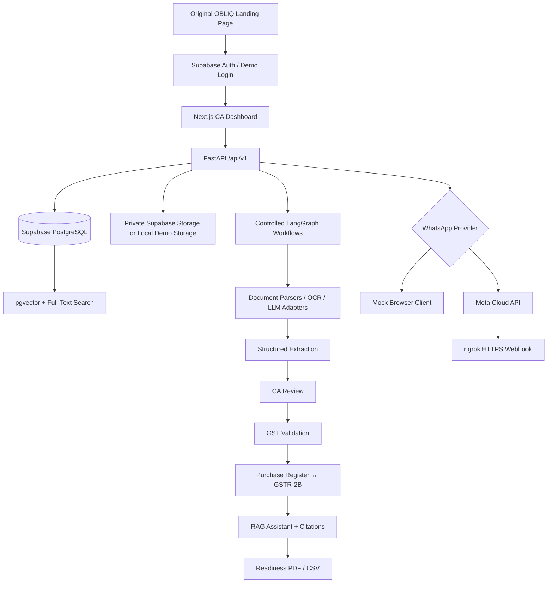

# OBLIQ GST Readiness Copilot

A lightweight, end-to-end hiring-project prototype for Indian Chartered Accountant firms. OBLIQ takes a client’s GST period from document request to a structured, reviewed, filing-ready preparation package.

> **Scope boundary:** This prototype does **not** file GST returns, pay GST, determine final ITC eligibility, store GST Portal credentials, or replace professional judgement. Every extracted field and outbound reminder remains subject to CA review.

## What the prototype demonstrates

- Original responsive Next.js landing page and CA dashboard
- Supabase email/password Auth with demo-token fallback
- Multi-tenant Supabase PostgreSQL schema and Row-Level Security
- `pgvector` and PostgreSQL full-text retrieval
- Secure, expiring client upload links
- Browser-based mock WhatsApp channel for the hosted demo
- Optional Meta WhatsApp Cloud API adapter for local testing
- PDF/image/CSV/XLSX/JSON classification and extraction
- Controlled LangGraph document and reminder workflows
- GSTIN/date/arithmetic/period/duplicate validation
- Purchase Register ↔ simplified GSTR-2B reconciliation
- Source-backed RAG assistant
- Human approval gates and audit events
- Readiness PDF and CSV exports
- Five synthetic client scenarios and generated demo files

## Architecture



## Two WhatsApp modes

### 1. Hosted/self-contained demo

```env
DEMO_MODE=true
WHATSAPP_PROVIDER=mock
AI_MODE=mock
USE_IN_MEMORY_DB=true
```

The judge uses two browser views:

- **CA dashboard:** creates and approves document requests/reminders.
- **Demo client:** receives simulated WhatsApp messages and uploads synthetic files.

Only the transport is simulated. Checklist updates, document parsing, extraction, validation, reconciliation, RAG, reports, and audit events use the actual backend workflow.

### 2. Local real Meta test

```env
WHATSAPP_PROVIDER=meta
ALLOW_LOCAL_CREDENTIAL_SETUP=true
```

The reviewer provides their own Meta developer credentials and verified test-recipient number. Meta’s test business number acts as the sender; the reviewer receives messages on their normal WhatsApp account. An HTTPS tunnel such as ngrok is required for inbound webhooks.

See [`docs/meta-whatsapp-setup.md`](docs/meta-whatsapp-setup.md).

## Repository structure

```text
.
├── backend/                 FastAPI, agents, parsers, RAG, WhatsApp providers
├── frontend/                Next.js App Router interface
├── supabase/                SQL migrations, pgvector, RLS and storage setup
├── scripts/                 demo generation, seed/reset, RAG and Meta helpers
├── demo_data/               synthetic GST files, fixtures and knowledge
├── docs/                    setup, deployment, architecture and walkthrough
├── .env.example
├── docker-compose.yml
└── Makefile
```

## Fastest local run: self-contained mock mode

### Prerequisites

- Python 3.11+
- Node.js 22+
- npm

### Terminal 1 — backend

```bash
cp .env.example .env
python -m venv .venv
# macOS/Linux: source .venv/bin/activate
# Windows PowerShell: .\.venv\Scripts\Activate.ps1
python -m pip install -e './backend[dev]'
python scripts/generate_demo_documents.py
cd backend
python -m uvicorn app.main:app --reload --port 8000
```

If PowerShell resolves `python`, `pip`, or `uvicorn` from different installations, do
not activate the environment. Invoke its interpreter explicitly from the repository root:

```powershell
& "$env:LOCALAPPDATA\Programs\Python\Python311\python.exe" -m venv .venv
& ".\.venv\Scripts\python.exe" -m pip install -e ".\backend[dev]"
& ".\.venv\Scripts\python.exe" scripts\generate_demo_documents.py
Set-Location backend
& "..\.venv\Scripts\python.exe" -m uvicorn app.main:app --reload --port 8000
```

### Terminal 2 — frontend

```bash
cd frontend
npm install
cp .env.local.example .env.local
npm run dev
```

Open:

- Frontend: `http://localhost:3000`
- FastAPI Swagger: `http://localhost:8000/docs`
- Health: `http://localhost:8000/api/v1/health`
- Mock client: `http://localhost:3000/demo-client`

### Demo credentials

| Role | Email | Password / Demo button |
|---|---|---|
| Partner / Firm Admin | `demo.admin@obliq.local` | `ChangeMe123!` or Partner demo button |
| GST Preparer | `demo.preparer@obliq.local` | `ChangeMe123!` or Preparer demo button |
| Reviewer | `demo.reviewer@obliq.local` | `ChangeMe123!` or Reviewer demo button |

In in-memory demo mode, the frontend uses the demo role buttons and backend demo bearer tokens. Password credentials apply when Supabase Auth is configured and seeded.

## Docker run

```bash
cp .env.example .env
python scripts/generate_demo_documents.py
docker compose up --build
```

The first Docker build requires internet access to download Python and npm packages.

## Supabase mode

1. Create a Supabase project or start the Supabase CLI locally.
2. Apply all SQL files in `supabase/migrations/`.
3. Fill in Supabase values in `.env`.
4. Set:

```env
USE_IN_MEMORY_DB=false
```

5. Seed synthetic users and data:

```bash
python scripts/seed_demo.py
```

6. Ingest demo knowledge if needed:

```bash
python scripts/ingest_knowledge.py
```

The migrations create:

- relational application tables
- `vector(384)` knowledge embeddings
- HNSW cosine index
- full-text GIN index
- vector and lexical RPC functions
- tenant-scoped RLS policies
- private Storage buckets

## RAG pipeline

### Ingestion

```text
PDF / Markdown / TXT / HTML / DOCX
→ checksum duplicate detection
→ text extraction
→ heading-aware chunks (900 characters, 140 overlap)
→ 384-dimensional embeddings
→ knowledge_sources + knowledge_chunks
```

### Retrieval

```text
Question
→ intent classification
→ structured application facts when required
→ vector RPC + full-text RPC
→ reciprocal-rank fusion
→ top context chunks
→ answer with citations
```

Hosted mock mode uses deterministic 384-dimensional feature-hash vectors, avoiding model downloads. Live mode uses `sentence-transformers/paraphrase-multilingual-MiniLM-L12-v2`.

## AI provider modes

```env
AI_MODE=mock
```

- deterministic demo extraction fixtures
- deterministic embeddings
- deterministic RAG responses
- no paid model keys required

```env
AI_MODE=live
TEXT_LLM_PROVIDER=groq
VISION_LLM_PROVIDER=gemini
```

Live adapters also support optional OpenAI fallback. The implementation uses deterministic parsers first; low-confidence invoice images or PDFs can be sent to Gemini document vision, while text-first irregular content can use the configured text LLM.

## Main API groups

- `/api/v1/clients`
- `/api/v1/applications`
- `/api/v1/documents`
- `/api/v1/public/upload/{token}`
- `/api/v1/applications/{id}/validate`
- `/api/v1/applications/{id}/reconcile`
- `/api/v1/assistant/query`
- `/api/v1/webhooks/whatsapp`
- `/api/v1/integrations/whatsapp/*`
- `/api/v1/applications/{id}/export`

Swagger documents the exact payloads at `/docs`.

## Tests and verification

```bash
cd backend
pytest
ruff check app tests
python -m compileall -q app ../scripts
```

Frontend:

```bash
cd frontend
npm run test
npm run lint
npm run build
```

## Guided hiring-demo story

1. Use **Partner demo** login.
2. Click **Reset demo** on the dashboard so the guided scenario starts from a clean 0/5 checklist.
3. Open **Raj Traders → April 2026**.
4. Draft and approve the initial document request.
5. Open **Demo Client** in another tab.
6. Send built-in synthetic samples for four categories, leaving Purchase Register missing.
7. Return to the CA dashboard and draft/approve a reminder.
8. Upload the built-in Purchase Register sample.
9. Review one extraction beside the original document.
10. Run validation.
11. Add duplicate/wrong-period samples if desired and run validation again.
12. Run Purchase Register ↔ GSTR-2B reconciliation.
13. Ask the RAG assistant why a mismatch is flagged.
14. Export the readiness PDF and CSV files.
15. Review the audit trail.

Full detail: [`docs/demo-walkthrough.md`](docs/demo-walkthrough.md).

## Manual deployment

Suggested prototype deployment:

- Frontend: Vercel
- Backend: Render or Railway
- Auth/database/storage: Hosted Supabase

The public deployment should keep:

```env
DEMO_MODE=true
WHATSAPP_PROVIDER=mock
AI_MODE=mock
ALLOW_LOCAL_CREDENTIAL_SETUP=false
```

No CI/CD is included by design. See [`docs/deployment.md`](docs/deployment.md).

## Security notes

- Service-role keys and Meta tokens are backend-only.
- Public upload tokens are random, hashed, expiring, and revocable.
- Supabase application tables use RLS.
- Storage buckets are private and accessed with signed URLs.
- Meta webhook signatures are verified when an app secret is configured.
- Local Meta credential storage is explicitly prototype-only and disabled on public deployment.
- All supplied client and tax information is synthetic.

## Known limitations

This is intentionally not production-grade. It omits real GST Portal filing, production secrets management, malware scanning, resilient job queues, high-scale OCR, official deadline synchronization, comprehensive tax-rule coverage, and external security certification.

See [`docs/limitations.md`](docs/limitations.md).

Verification evidence and environment-limited checks are recorded in [`docs/verification.md`](docs/verification.md).
